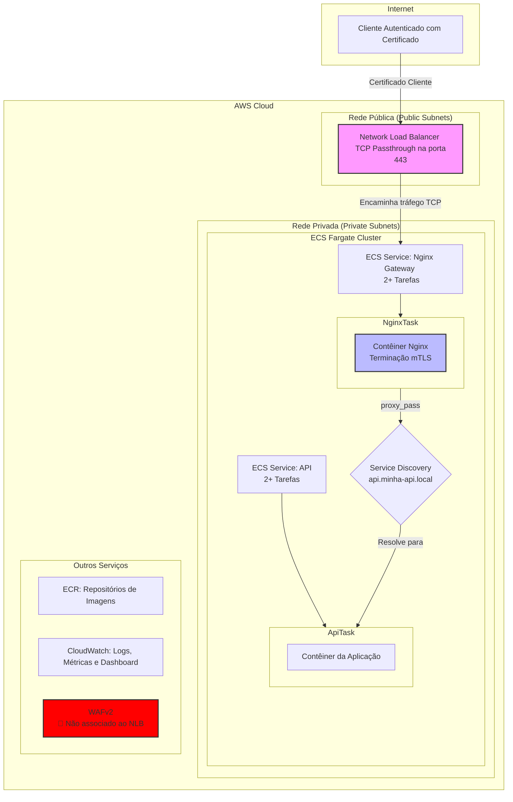

# Infraestrutura como Código para API Gateway com mTLS em AWS ECS Fargate

## Tabela de Conteúdo

1.  [Visão Geral](#1-visão-geral)
2.  [Arquitetura de Referência](#2-arquitetura-de-referência)
    *   [Diagrama da Arquitetura](#diagrama-da-arquitetura)
    *   [Fluxo de Requisição](#fluxo-de-requisição)
    *   [Componentes Principais](#componentes-principais)
3.  [Provisionamento da Infraestrutura (IaC)](#3-provisionamento-da-infraestrutura-iac)
4.  [Pipeline de Deploy (CI/CD)](#4-pipeline-de-deploy-cicd)
5.  [Postura de Segurança (DevSecOps)](#5-postura-de-segurança-devsecops)
6.  [Monitoramento e Observabilidade](#6-monitoramento-e-observabilidade)
7.  [Testes e Qualidade de Código](#7-testes-e-qualidade-de-código)
8.  [Como Contribuir](#8-como-contribuir)
9.  [Licença](#9-licença)

---

## 1. Visão Geral

Este projeto provisiona uma infraestrutura robusta, escalável e segura na AWS, projetada para hospedar aplicações em contêineres utilizando **Amazon ECS (Elastic Container Service)** com **Fargate**. A solução adota o padrão de **API Gateway** com um proxy Nginx para terminação de **mTLS (Mutual TLS)**, garantindo autenticação mútua e segura entre cliente e servidor.

A infraestrutura é inteiramente gerenciada como código (IaC), oferecendo duas implementações funcionalmente equivalentes: **Terraform** e **AWS CDK (Cloud Development Kit)**.

-   **Objetivo Estratégico:** Automatizar o provisionamento de uma arquitetura cloud-native, segura e resiliente, seguindo as melhores práticas de DevSecOps.
-   **Caso de Uso:** Ideal para APIs e microsserviços que exigem um alto nível de segurança, como sistemas financeiros (Open Banking), saúde (HealthTech) ou qualquer aplicação que processe dados sensíveis e necessite de autenticação de cliente baseada em certificados.

---

## 2. Arquitetura de Referência

A arquitetura foi desenhada com base nos princípios de segurança em camadas (defense-in-depth) e menor privilégio.

### Diagrama da Arquitetura



### Fluxo de Requisição

1.  **Conexão do Cliente:** O cliente, de posse de um certificado digital válido, inicia uma conexão TLS com o **Network Load Balancer (NLB)** na porta 443.
2.  **TCP Passthrough:** O NLB opera na camada 4 (transporte) e não inspeciona o tráfego TLS. Ele simplesmente encaminha os pacotes TCP para uma das tarefas do serviço Nginx que estão na rede privada.
3.  **Terminação mTLS no Nginx:** O contêiner Nginx recebe o tráfego. Ele está configurado para realizar o handshake mTLS, validando o certificado do cliente contra uma CA (Certificate Authority) confiável.
4.  **Validação e Proxy:**
    -   Se o certificado do cliente for válido (`$ssl_client_verify = "SUCCESS"`), o Nginx atua como proxy reverso, encaminhando a requisição HTTP para o serviço da API.
    -   Se o certificado for inválido ou ausente, o Nginx retorna um código `403 Forbidden`, bloqueando o acesso.
5.  **Service Discovery:** O Nginx utiliza o **AWS Cloud Map (Service Discovery)** para resolver o endereço IP interno e atual das tarefas da API (`api.minha-api.local`), garantindo uma comunicação resiliente.
6.  **Processamento na API:** A tarefa da API recebe a requisição, processa e retorna a resposta através do mesmo fluxo.

### Componentes Principais

-   **AWS ECS com Fargate:** Orquestração de contêineres serverless, eliminando a necessidade de gerenciar instâncias EC2.
-   **Network Load Balancer (NLB):** Alta performance para tráfego TCP, ideal para TCP passthrough, preservando o handshake TLS de ponta a ponta até o gateway.
-   **Nginx Gateway:** Contêiner Nginx atuando como API Gateway, responsável pela terminação mTLS e roteamento.
-   **Amazon ECR:** Repositório privado e seguro para as imagens Docker.
-   **VPC e Sub-redes:** Ambiente de rede isolado com sub-redes públicas para o NLB e privadas para os contêineres, restringindo o acesso direto.
-   **AWS Cloud Map:** Implementa o Service Discovery para comunicação interna entre os serviços.
-   **CloudWatch:** Centraliza logs, métricas e dashboards para observabilidade.

---

## Configuração do Ambiente

### Pré-requisitos

Antes de começar, garanta que você tenha as seguintes ferramentas instaladas e configuradas:

-   [AWS CLI](https://aws.amazon.com/cli/): Autenticado com permissões para criar os recursos necessários.
-   [Terraform](https://www.terraform.io/downloads.html): Versão `1.0.0` ou superior.
-   [Docker](https://www.docker.com/get-started): Para construir e enviar imagens para o ECR.
-   [Git](https://git-scm.com/): Para controle de versão.

### Instalação

1.  **Clone o repositório:**
    ```bash
    git clone <URL_DO_SEU_REPOSITORIO>
    cd aws-ecs-fargate-infra
    ```

2.  **Configure as credenciais da AWS:**
    Certifique-se de que suas credenciais da AWS estão configuradas corretamente. Você pode usar o comando `aws configure` ou definir as variáveis de ambiente:
    ```bash
    export AWS_ACCESS_KEY_ID="SUA_ACCESS_KEY"
    export AWS_SECRET_ACCESS_KEY="SUA_SECRET_KEY"
    export AWS_REGION="sua-regiao" # Ex: us-east-1
    ```

### Variáveis de Ambiente

As configurações principais da infraestrutura são gerenciadas através do arquivo `terraform/variables.tf`. Você pode criar um arquivo `terraform.tfvars` para substituir os valores padrão sem modificar o código original.

**Exemplo de `terraform.tfvars`:**

```hcl
# terraform/terraform.tfvars

aws_region      = "us-east-1"
project_name    = "meu-projeto"
vpc_cidr        = "10.0.0.0/16"
public_subnets  = ["10.0.1.0/24", "10.0.2.0/24"]
private_subnets = ["10.0.3.0/24", "10.0.4.0/24"]
```

---

## Pipeline CI/CD

O processo de integração e entrega contínua é gerenciado por scripts localizados no diretório `scripts/`.

### Etapas do Pipeline

1.  **Build:** A imagem Docker da aplicação é construída.
2.  **Push:** A imagem é enviada para o repositório ECR na AWS.
3.  **Deploy:** O Terraform é executado para aplicar as mudanças na infraestrutura e atualizar o serviço ECS com a nova imagem.

### Comandos de Deploy

Para executar o deploy completo, utilize o script principal:

```powershell
# No Windows (PowerShell)
.\scripts\deploy.ps1 -env "staging"

# No Linux/macOS (Bash)
./scripts/deploy.sh staging
```

O script `deploy_nginx_only.ps1` é específico para o Nginx e pode ser usado para atualizações que afetam apenas este componente.

### Ferramentas

-   **PowerShell / Bash:** Para a orquestração do deploy.
-   **Docker:** Para o gerenciamento do ciclo de vida dos contêineres.
-   **Terraform:** Para o provisionamento da infraestrutura.

---

## Gerenciamento de Infraestrutura

A infraestrutura é totalmente gerenciada como código usando **Terraform**. Os arquivos de configuração estão no diretório `terraform/`.

### Estrutura dos Arquivos Terraform

-   `main.tf`: Provedor AWS e configurações gerais.
-   `network.tf`: Definição da VPC, sub-redes, tabelas de rotas e gateways.
-   `security.tf`: Security Groups para controlar o tráfego.
-   `ecr.tf`: Criação do repositório ECR.
-   `ecs.tf`: Definição do cluster ECS, task definitions e serviços.
-   `alb.tf`: Configuração do Application Load Balancer.
-   `monitoring.tf`: Recursos de monitoramento (CloudWatch).
-   `waf.tf`: Configuração do Web Application Firewall.
-   `variables.tf`: Variáveis de entrada para customização.
-   `outputs.tf`: Saídas, como o DNS do Load Balancer.

### Como Aplicar a Infraestrutura

1.  **Navegue até o diretório do Terraform:**
    ```bash
    cd terraform
    ```

2.  **Inicialize o Terraform:**
    ```bash
    terraform init
    ```

3.  **Planeje as mudanças:**
    ```bash
    terraform plan
    ```

4.  **Aplique as mudanças:**
    ```bash
    terraform apply
    ```

---

## Monitoramento e Logs

### Ferramentas

-   **AWS CloudWatch:** É a ferramenta principal para coletar logs e métricas.
    -   **Logs:** Os logs dos contêineres são enviados automaticamente para o CloudWatch Logs, organizados por grupos de logs.
    -   **Métricas:** Métricas de uso de CPU, memória do serviço ECS, e o estado do ALB estão disponíveis no CloudWatch Metrics.
-   **AWS X-Ray (Opcional):** Pode ser integrado para rastreamento de requisições e análise de performance.

### Dashboards e Alertas

Recomenda-se a criação de dashboards no CloudWatch para visualizar as principais métricas de saúde da aplicação em tempo real. Além disso, podem ser configurados alertas (Alarms) para notificar a equipe em caso de anomalias, como:

-   Uso de CPU/memória acima de um limite.
-   Número excessivo de respostas de erro (HTTP 5xx) no ALB.
-   Health checks falhando.

---

## Segurança

### Boas Práticas

-   **Princípio do Menor Privilégio:** As permissões IAM para os serviços e tarefas ECS são restritas ao mínimo necessário.
-   **Segredos:** Dados sensíveis, como senhas de banco de dados e chaves de API, devem ser gerenciados pelo **AWS Secrets Manager** ou **Parameter Store**, e não hard-coded.
-   **Rede:** A aplicação roda em sub-redes privadas, sem acesso direto da internet. O acesso é mediado pelo ALB em sub-redes públicas.
-   **Security Groups:** Atuam como um firewall virtual para controlar o tráfego de entrada e saída das tarefas ECS e do ALB.

### Autenticação e Autorização

-   A autenticação de usuários na aplicação é de responsabilidade da própria aplicação.
-   Para acesso à infraestrutura AWS, utiliza-se o **IAM (Identity and Access Management)**, com políticas que definem quem pode fazer o quê.

### Gerenciamento de Segredos

Para injetar segredos nos contêineres de forma segura, utilize a integração do ECS com o AWS Secrets Manager.

**Exemplo em uma Task Definition:**

```json
"secrets": [
    {
        "name": "DATABASE_PASSWORD",
        "valueFrom": "arn:aws:secretsmanager:REGION:ACCOUNT_ID:secret:SECRET_NAME-XXXXXX"
    }
]
```

---

## Testes e Qualidade

A qualidade do código é garantida através de uma suíte de testes automatizados e ferramentas de análise estática.

### Testes Automatizados

-   **Testes Unitários:** Utilizamos [Jest](https://jestjs.io/) para testes unitários. Para executar os testes, rode o comando na raiz do projeto da aplicação:
    ```bash
    npm test
    ```

-   **Testes de Integração:** Os testes de integração validam a interação entre os diferentes serviços e componentes da aplicação. Eles são executados com [Jest](https://jestjs.io/) e [Supertest](https://github.com/ladjs/supertest).
    ```bash
    npm run test:integration
    ```

-   **Testes End-to-End (E2E):** Os fluxos completos do usuário são validados utilizando [Cypress](https://www.cypress.io/). Para abrir o executor de testes do Cypress:
    ```bash
    npm run cypress:open
    ```

### Cobertura de Código (Code Coverage)

A cobertura de testes é gerada pelo Jest. Nosso objetivo é manter uma cobertura de no mínimo **80%**. Para gerar o relatório de cobertura, execute:
```bash
npm test -- --coverage
```
O relatório detalhado estará disponível no diretório `coverage/`.

### Linting

-   **Código da Aplicação:** Usamos [ESLint](https://eslint.org/) para manter um padrão de código consistente e evitar erros comuns. Para verificar os arquivos:
    ```bash
    npm run lint
    ```
    Para corrigir automaticamente os problemas:
    ```bash
    npm run lint:fix
    ```

-   **Terraform:** Para garantir a qualidade e a formatação do código de infraestrutura, utilizamos os comandos nativos do Terraform:
    ```bash
    # Formata o código
    terraform fmt

    # Valida a sintaxe
    terraform validate
    ```

---

## Como Contribuir

Agradecemos o seu interesse em contribuir! Para garantir um processo eficiente, por favor, siga estas diretrizes:

1.  **Faça um Fork** do repositório.
2.  **Crie uma Nova Branch:** `git checkout -b feature/sua-feature`.
3.  **Faça suas Alterações:** Siga as boas práticas de código e adicione testes, se aplicável.
4.  **Envie um Pull Request (PR):** Descreva claramente as mudanças e o motivo.
5.  Aguarde a revisão do código.

---

## Licença e Contato

### Contato

-   **Nome do Mantenedor:** Fidêncio Vieira
-   **Email:** fidenciovieira@hotmail.com
-   **GitHub:** [xsysyphus](https://github.com/xsysyphus)
