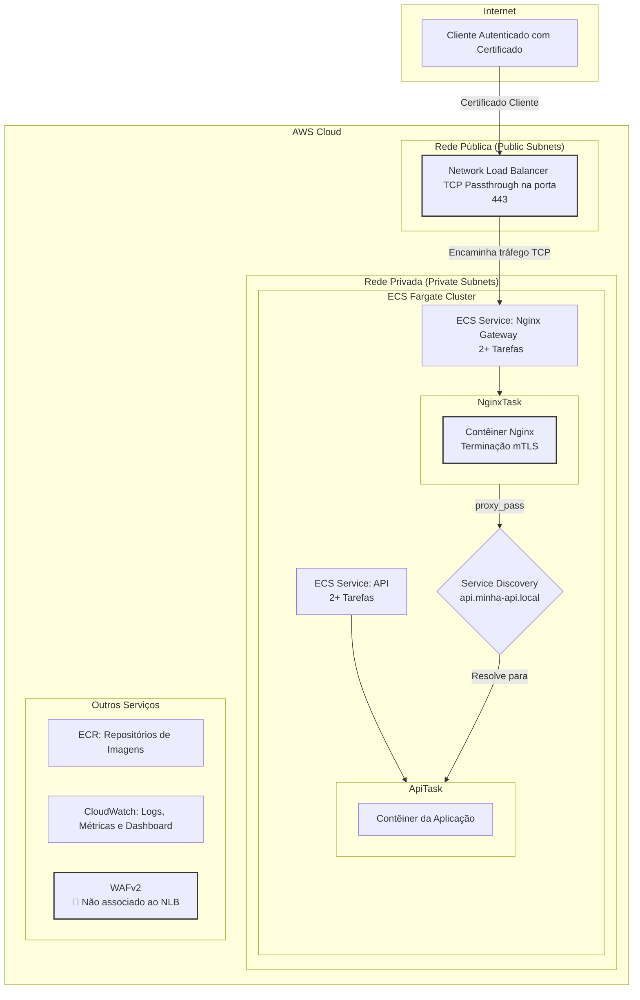

# Infraestrutura como Código para API Gateway com mTLS em AWS ECS Fargate

## Tabela de Conteúdo

1.  [Visão Geral](#1-visão-geral)
2.  [Arquitetura de Referência](#2-arquitetura-de-referência)
    *   [Diagrama da Arquitetura](#diagrama-da-arquitetura)
    *   [Fluxo de Requisição](#fluxo-de-requisição)
    *   [Componentes Principais](#componentes-principais)
3.  [Provisionamento da Infraestrutura (IaC)](#3-provisionamento-da-infraestrutura-iac)
4.  [Pipeline de Deploy (CI/CD)](#4-pipeline-de-deploy-cicd)
5.  [Postura de Segurança (DevSecOps)](#5-postura-de-segurança-devsecops)
6.  [Monitoramento e Observabilidade](#6-monitoramento-e-observabilidade)
7.  [Testes e Qualidade de Código](#7-testes-e-qualidade-de-código)
8.  [Como Contribuir](#8-como-contribuir)
9.  [Licença](#9-licença)

---

## 1. Visão Geral

Este projeto provisiona uma infraestrutura robusta, escalável e segura na AWS, projetada para hospedar aplicações em contêineres utilizando **Amazon ECS (Elastic Container Service)** com **Fargate**. A solução adota o padrão de **API Gateway** com um proxy Nginx para terminação de **mTLS (Mutual TLS)**, garantindo autenticação mútua e segura entre cliente e servidor.

A infraestrutura é inteiramente gerenciada como código (IaC), oferecendo duas implementações funcionalmente equivalentes: **Terraform** e **AWS CDK (Cloud Development Kit)**.

-   **Objetivo Estratégico:** Automatizar o provisionamento de uma arquitetura cloud-native, segura e resiliente, seguindo as melhores práticas de DevSecOps.
-   **Caso de Uso:** Ideal para APIs e microsserviços que exigem um alto nível de segurança, como sistemas financeiros (Open Banking), saúde (HealthTech) ou qualquer aplicação que processe dados sensíveis e necessite de autenticação de cliente baseada em certificados.

---

## 2. Arquitetura de Referência

A arquitetura foi desenhada com base nos princípios de segurança em camadas (defense-in-depth) e menor privilégio.

### Diagrama da Arquitetura



### Fluxo de Requisição

1.  **Conexão do Cliente:** O cliente, de posse de um certificado digital válido, inicia uma conexão TLS com o **Network Load Balancer (NLB)** na porta 443.
2.  **TCP Passthrough:** O NLB opera na camada 4 (transporte) e não inspeciona o tráfego TLS. Ele simplesmente encaminha os pacotes TCP para uma das tarefas do serviço Nginx que estão na rede privada.
3.  **Terminação mTLS no Nginx:** O contêiner Nginx recebe o tráfego. Ele está configurado para realizar o handshake mTLS, validando o certificado do cliente contra uma CA (Certificate Authority) confiável.
4.  **Validação e Proxy:**
    -   Se o certificado do cliente for válido (`$ssl_client_verify = "SUCCESS"`), o Nginx atua como proxy reverso, encaminhando a requisição HTTP para o serviço da API.
    -   Se o certificado for inválido ou ausente, o Nginx retorna um código `403 Forbidden`, bloqueando o acesso.
5.  **Service Discovery:** O Nginx utiliza o **AWS Cloud Map (Service Discovery)** para resolver o endereço IP interno e atual das tarefas da API (`api.minha-api.local`), garantindo uma comunicação resiliente.
6.  **Processamento na API:** A tarefa da API recebe a requisição, processa e retorna a resposta através do mesmo fluxo.

### Componentes Principais

-   **AWS ECS com Fargate:** Orquestração de contêineres serverless, eliminando a necessidade de gerenciar instâncias EC2.
-   **Network Load Balancer (NLB):** Alta performance para tráfego TCP, ideal para TCP passthrough, preservando o handshake TLS de ponta a ponta até o gateway.
-   **Nginx Gateway:** Contêiner Nginx atuando como API Gateway, responsável pela terminação mTLS e roteamento.
-   **Amazon ECR:** Repositório privado e seguro para as imagens Docker.
-   **VPC e Sub-redes:** Ambiente de rede isolado com sub-redes públicas para o NLB e privadas para os contêineres, restringindo o acesso direto.
-   **AWS Cloud Map:** Implementa o Service Discovery para comunicação interna entre os serviços.
-   **CloudWatch:** Centraliza logs, métricas e dashboards para observabilidade.

---

## 3. Provisionamento da Infraestrutura (IaC)

Este projeto oferece suporte dual-stack para IaC. Escolha a ferramenta de sua preferência.

### Pré-requisitos Comuns

-   [AWS CLI](https://aws.amazon.com/cli/): Autenticado com permissões de `AdministratorAccess` (ou equivalentes).
-   [Docker](https://www.docker.com/get-started): Para build e push de imagens de contêiner.
-   [Git](https://git-scm.com/): Para controle de versão.

### Opção 1: Terraform (Padrão)

Localizado no diretório `terraform/`.

#### Pré-requisitos Adicionais

-   [Terraform](https://www.terraform.io/downloads.html) >= `1.0.0`

#### Estrutura dos Módulos

-   `main.tf`: Configuração do provider AWS.
-   `network.tf`: Recursos de rede (VPC, Subnets, IGW, NAT Gateway).
-   `security.tf`: Security Groups.
-   `ecr.tf`: Repositórios ECR.
-   `ecs.tf`: Cluster ECS, Task Definitions, Services e Service Discovery.
-   `alb.tf`: Network Load Balancer e Target Group.
-   `monitoring.tf`: CloudWatch Dashboard.
-   `waf.tf`: Recursos do WAF (ver nota de segurança).
-   `variables.tf` / `outputs.tf`: Entradas e saídas da infraestrutura.

#### Passos para o Deploy

1.  **Navegue até o diretório:**
    ```bash
    cd terraform
    ```

2.  **Inicialize o Terraform:**
    ```bash
    terraform init
    ```

3.  **(Opcional) Crie um arquivo `terraform.tfvars` para customizar as variáveis:**
    ```hcl
    # terraform/terraform.tfvars
    aws_region   = "us-east-1"
    project_name = "minha-api-prod"
    ```

4.  **Planeje e revise as mudanças:**
    ```bash
    terraform plan
    ```

5.  **Aplique a infraestrutura:**
    ```bash
    terraform apply --auto-approve
    ```

### Opção 2: AWS CDK (Alternativa)

Localizado no diretório `cdk/`.

#### Pré-requisitos Adicionais

-   [Node.js](https://nodejs.org/) >= `18.0`
-   AWS CDK CLI: `npm install -g aws-cdk`

#### Estrutura da Stack

-   `app.ts`: Ponto de entrada da aplicação CDK.
-   `lib/app-infra-stack.ts`: Definição de toda a stack de infraestrutura, contendo todos os recursos (VPC, ECS, NLB, etc.).

#### Passos para o Deploy

1.  **Instale as dependências e compile o projeto:**
    ```bash
    cd cdk
    npm install
    npm run build
    ```

2.  **Realize o Bootstrap do CDK (apenas na primeira vez por conta/região):**
    ```bash
    cdk bootstrap
    ```

3.  **Sintetize e verifique as diferenças:**
    ```bash
    cdk synth
    cdk diff
    ```

4.  **Faça o deploy da stack:**
    ```bash
    # Use os parâmetros de contexto para customizar
    cdk deploy --require-approval never \
      -c projectName=minha-api-prod \
      -c environment=prod
    ```

---

## 4. Pipeline de Deploy (CI/CD)

Os scripts no diretório `scripts/` simulam um pipeline de CI/CD para o deploy das imagens das aplicações nos serviços ECS provisionados.

### Processo de Deploy das Aplicações

1.  **Build:** Uma nova imagem Docker é construída a partir do código-fonte da aplicação (API ou Nginx).
2.  **Tagging:** A imagem é tagueada com a URI do repositório ECR correspondente e a tag `latest`.
3.  **Push:** A imagem é enviada para o Amazon ECR.
4.  **Update do Serviço ECS:** O script força um novo deploy no serviço ECS (`force-new-deployment`). O ECS Agent em execução no Fargate detecta a nova imagem e substitui as tarefas antigas pelas novas de forma gradual (rolling update).

### Execução via Scripts

#### Script `deploy.sh` (Linux/macOS - Recomendado)

Este script obtém dinamicamente os outputs do Terraform, evitando a necessidade de configurações manuais.

```bash
# Certifique-se de estar na raiz do projeto
./scripts/deploy.sh
```

#### Script `deploy.ps1` (Windows PowerShell)

⚠️ **Atenção:** Este script requer a **configuração manual** das variáveis no início do arquivo. Preencha-as com os outputs do `terraform output` ou `cdk outputs`.

```powershell
# Execute a partir da raiz do projeto
.\scripts\deploy.ps1
```

---

## 5. Postura de Segurança (DevSecOps)

A segurança é um pilar fundamental desta arquitetura.

### Autenticação Mútua (mTLS)

-   **Implementação:** O mTLS é imposto pelo Gateway Nginx. A configuração em `nginx/nginx.conf` (`ssl_verify_client optional`) permite que a verificação seja feita dentro de um bloco `location`, possibilitando a exposição de endpoints públicos (como `/health`) que não exigem certificado.
-   **Geração de Certificados:** Utilize o script `nginx/gerar_certificados.sh` para criar uma CA privada e emitir certificados de servidor e cliente.
    ```bash
    # Gere os certificados antes de construir a imagem do Nginx
    # O Common Name deve ser o DNS do seu NLB ou um domínio customizado
    ./nginx/gerar_certificados.sh seu-dominio.com
    ```
-   **Teste de Conexão:**
    ```bash
    # Use os certificados de cliente gerados para testar
    curl --cert ./nginx/certs/cliente-....crt \
         --key ./nginx/certs/cliente-....key \
         -k https://<DNS_DO_SEU_NLB>/
    ```

### Segurança de Rede (Zero Trust)

-   **Isolamento:** As tarefas ECS rodam em sub-redes privadas sem acesso direto à internet. A saída é controlada por um NAT Gateway.
-   **Security Groups:** Atuam como firewalls stateful, controlando o tráfego com regras estritas:
    -   **SG Nginx:** Permite tráfego de entrada apenas do NLB na porta 443.
    -   **SG API:** Permite tráfego de entrada apenas do SG do Nginx na porta da aplicação (5000).

### Web Application Firewall (WAF)

-   **Status Atual:** Os recursos do `AWS WAFv2` são provisionados tanto pelo Terraform quanto pelo CDK.
-   **🚧 Limitação Importante:** O **AWS WAF não pode ser associado a Network Load Balancers (NLBs)**, pois o WAF opera na camada 7 (HTTP/S) e o NLB na camada 4 (TCP).
-   **Recomendação:** Se a proteção do WAF for um requisito mandatório (para inspeção de SQL Injection, XSS, etc.), a arquitetura deve ser modificada para utilizar um **Application Load Balancer (ALB)**. Um ALB permitiria a associação com o WAF, mas exigiria uma abordagem diferente para o mTLS (o ALB terminaria o TLS e encaminharia o tráfego para o Nginx, que poderia então fazer um novo handshake mTLS).

### Gestão de Identidade e Acesso (IAM)

-   **Princípio do Menor Privilégio:** A `ecs_task_execution_role` concede apenas as permissões essenciais para que o ECS Agent possa puxar imagens do ECR e enviar logs para o CloudWatch. Nenhuma permissão adicional é concedida por padrão.

### Análise de Imagens (ECR Scan)

-   A funcionalidade **Scan on push** está habilitada nos repositórios ECR. A cada `docker push`, o ECR automaticamente analisa a imagem em busca de vulnerabilidades conhecidas (CVEs), fornecendo um relatório de segurança.

---

## 6. Monitoramento e Observabilidade

-   **CloudWatch Logs:** Todos os logs (`stdout`/`stderr`) dos contêineres Nginx e API são enviados para grupos de logs dedicados no CloudWatch, com uma política de retenção configurável (padrão: 7 dias).
-   **CloudWatch Metrics:** Métricas de performance (CPU, Memória) dos serviços ECS, bem como métricas do NLB (Conexões Ativas, Hosts Saudáveis), são coletadas automaticamente.
-   **CloudWatch Dashboard:** Um dashboard customizado é provisionado para centralizar a visualização das métricas mais críticas da infraestrutura e dos serviços, permitindo um monitoramento proativo.

---

## 7. Testes e Qualidade de Código

### Validação da Infraestrutura

-   **Terraform:** Utilize os comandos nativos para garantir a qualidade do código IaC.
    ```bash
    # Valida a sintaxe dos arquivos
    terraform validate

    # Formata o código para seguir o padrão canônico
    terraform fmt
    ```
-   **CDK:** A compilação TypeScript (`npm run build`) e o linter (`npm run lint`, se configurado) garantem a qualidade do código.

### Testes da Aplicação

-   Os testes unitários, de integração e E2E são de responsabilidade do repositório da aplicação. Esta infraestrutura é agnóstica à aplicação, mas foi projetada para suportar um ciclo de vida de desenvolvimento moderno que inclua testes automatizados no pipeline de CI/CD antes do deploy.

---

## 8. Como Contribuir

1.  **Fork** este repositório.
2.  Crie uma nova **Branch** (`git checkout -b feature/minha-feature`).
3.  Faça suas alterações e **commit** (`git commit -m 'feat: Adiciona nova feature'`).
4.  **Push** para a sua branch (`git push origin feature/minha-feature`).
5.  Abra um **Pull Request**.

---

## 9. Licença

Este projeto está licenciado sob a Licença MIT.
